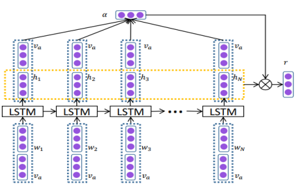

# correlation-analysis
对微博评论与目标人物是否相关进行三分类(相关,不确定,不相关)

[](https://choosealicense.com/licenses/mit/)
[](https://github.com/faker2cumtb/correlation-analysis/pulls)
[](https://github.com/faker2cumtb/correlation-analysis/releases)

---

## 目录

```text
data/       存放训练语料测试语料
    dataset/    数据集
data_utils/     数据管理相关工具
model/      模型和训练算法
result/       实验记录相关日志信息,保存模型文件
Evaluation.py      验证文件
main.py     主程序

```

---
## 模型介绍
AT_LSTM模型结构图如下 :



Introduction:  
The Architecture of Attention-based LSTM with Aspect Embedding. The aspect embeddings have been take as input
along with the word embeddings. {w1, w2,...,wN}represent the word vector in a sentence whose length is N.varepresents the
aspect embedding. αis the attention weight. {h1, h2, . . . , hN}is the hidden vector.  

Paper link:  
[Attention-based_LSTM_for_Aspect-level_Sentiment_Classification](https://www.researchgate.net/publication/311990858_Attention-based_LSTM_for_Aspect-level_Sentiment_Classification) 


## 主程序介绍
mian.py 
   
终端运行 mian.py文件需要输入的相关参数介绍

| Parameter | Introduce | Demo |
| ------ | ------ | ------ |
|--name|模型名称|lstm|
|--dim_hidden|隐层神经元数|100
|--dataset|数据集|data|
|--grained|类别数|3|
|--epoch|迭代次数|30|
|--batch_size|batch大小|128|

## python及相关依赖包版本
| Name | Version | 
| ------ | ------ | 
|python|3.6.7|
|tensorflow|1.12.0|
|jieba|0.39|


